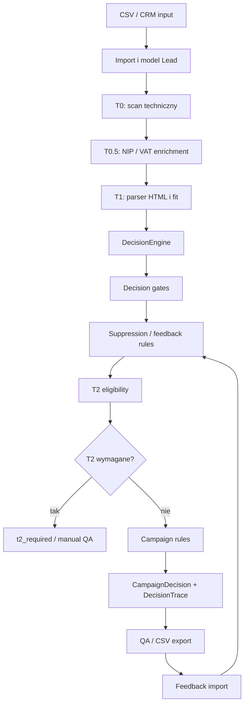

# Architektura

`leadpipe` jest deterministycznym, config-first pipeline'em dla leadow B2B. Kod zbiera sygnaly T0/T0.5/T1, a `DecisionEngine` podejmuje decyzje na podstawie wersjonowanych plikow YAML w `leadpipe/rules/`.

## Flow T0 -> T0.5 -> T1 -> T2



W obecnym kodzie T0, T0.5, T1 i decision engine dzialaja. T2 istnieje jako ruleset kwalifikacji i specyfikacja promptow, ale nie ma modulu runtime dla screenshotow ani vision.

## Etapy

### Import

CLI czyta CSV przez `parse_csv(..., ImportCsvSchema)`, waliduje rekordy i zapisuje je do lokalnego stanu JSON jako modele `Lead`.

Wejscie minimalne:

```csv
domain,url,company_name,nip,source,contact_email,notes
example.pl,https://example.pl,Example Sp. z o.o.,1234563218,manual,biuro@example.pl,test
```

Wyjscie: lista `Lead` w `.leadpipe/state.json` albo w pliku z `LEADPIPE_STATE`.

### T0: skan techniczny

Modul: `leadpipe/t0/`.

T0 przyjmuje domene i zbiera tanie, techniczne sygnaly:

- DNS: A/AAAA, MX, TXT;
- HTTP/HTTPS: status, final URL, redirects, naglowki, bledy przejsciowe;
- TLS: waznosc certyfikatu, issuer, wygasniecie;
- HTML: viewport, title/OG, formularze, CTA, ukryty kontakt;
- technologie: WordPress, Joomla/Drupal, GTM, Meta Pixel, stare assety;
- performance: TTFB, rozmiar strony, gzip, cache headers.

Wyjscie `compute_t0_signals()` to plaski slownik sygnalow plus `scan_result` z surowymi wynikami sekcji.

### T0.5: enrichment biznesowy

Modul: `leadpipe/t0_5/`.

T0.5 przyjmuje `Lead` i HTML z T0. Warstwa:

- normalizuje i waliduje NIP;
- probuje znalezc NIP w HTML;
- opcjonalnie odpytuje GUS/REGON hook;
- sprawdza status VAT przez Biala Liste;
- zapisuje wynik w cache po identyfikatorze leada i hashu HTML;
- aktualizuje payload leada o NIP i nazwe prawna, jesli sa dostepne.

Wyjscie `run_t0_5()`:

```python
{
    "lead": {...},
    "enrichment": {"nip": "...", "vat_status": "...", "regon": "..."},
    "signals": {
        "nip_present": True,
        "regon_present": False,
        "vat_active": True,
        "company_confirmed": True,
    },
}
```

### T1: parser tresci i kontaktu

Modul: `leadpipe/t1/`.

T1 analizuje HTML pobrany przez T0:

- JSON-LD: `Organization`, `LocalBusiness`, `Corporation`, `Store`, `ProfessionalService`;
- kontakt: e-mail, telefon, social links;
- formularze: pola, metoda, czy wyglada jak formularz kontaktowy;
- CTA: liczba i jakosc wezwan do kontaktu;
- branza: proste heurystyki dla industrial/services/medical/digital;
- scoring: `contactability`, `industry_fit`, `lead_value`, `campaign_confidence`.

Wyjscie `run_t1()` zawiera sekcje parserow i slownik `signals`.

### T2: selektywna wizja

T2 jest zaplanowane jako warstwa kosztowa i selektywna. Z dokumentow i `t2_eligibility.yml` wynika, ze T2 powinno byc uruchamiane tylko gdy screenshot moze zmienic decyzje:

- claim dotyczy wygladu, CTA, mobile lub trust;
- T0 widzi problem, ale T1 nie daje bezpiecznego hooka;
- dwie kampanie sa blisko siebie;
- dowody T0/T1 sa sprzeczne.

Docelowe wejscie: screenshot desktop/mobile lub desktop + podstrona kontakt/o nas/oferta, context T0/T1 i lista dozwolonych kampanii.

Obecne wyjscie runtime: brak, bo modul `leadpipe/t2/` nie istnieje. Engine moze jednak zwrocic `t2_required` na podstawie sygnalow.

## DecisionEngine

`DecisionEngine` jest rdzeniem decyzyjnym:

1. Laduje wszystkie `*.yml` z `leadpipe/rules/`.
2. Waliduje je modelami `RuleFile`, `Rule`, `Condition`.
3. Sortuje wszystkie reguly po `priority`, potem po `key`.
4. Buduje context z modelu `Lead` i sygnalow T0/T0.5/T1/T2/feedback.
5. Ocenia reguly do pierwszego matcha.
6. Tworzy `CampaignDecision` i `DecisionTrace`.

### Rulesety

Kazdy plik YAML ma:

```yaml
version: "ruleset-2026-05-23-www-final-v1"
rules:
  - key: RULE_KEY
    priority: 100
    combine: and
    conditions:
      - signal: contactability
        operator: gte
        value: 55
    decision: manual_review
    description: "Opis decyzji."
```

### Operatory

Silnik obsluguje:

- istnienie: `exists`, `missing`;
- porownania: `eq`, `neq`, `gte`, `gt`, `lte`, `lt`;
- kolekcje: `in`, `contains`.

### Tryby laczenia

| Tryb | Dzialanie |
|---|---|
| `and` | Wszystkie warunki musza przejsc. Score = udzial spelnionych warunkow. |
| `or` | Wystarczy jeden warunek. Score = udzial spelnionych warunkow. |
| `weighted` | Sumuje wagi spelnionych warunkow i porownuje z `threshold`. |

### Gates

Bramki decyzyjne maja najnizsze priorytety liczbowe i dlatego wygrywaja przed kampaniami. Chronia przed eksportem leadow z opt-outem, suppression, niska jakoscia danych, konkurencja, bledami skanu i niska kontaktowalnoscia.

### Suppression

Suppression jest modelowane jako osobny ruleset oraz tabela `suppression_entries`. W runtime engine oczekuje sygnalow takich jak `suppressed`, `hard_bounce_active`, `active_customer`, `cooldown_active` albo `opt_out`. Jesli sygnal jest obecny, reguly zwracaja `skip`.

### Trace

Kazda decyzja zawiera trace:

- `evaluated_rules`: lista ocenionych regul do momentu pierwszego matcha;
- `winning_rule`: zwycieska regula;
- `blocked_by`: reguly blokujace, np. suppression albo skip;
- `score_breakdown`: skladniki scoringu;
- `decision_reason`: opis czytelny dla QA.

## Baza Danych

`leadpipe/db_schema.py` definiuje async SQLAlchemy schema pod Postgres. CLI MVP uzywa pliku JSON jako prostego stanu, ale schema DB opisuje docelowy storage operacyjny.

### Tabele

| Tabela | Model | Opis |
|---|---|---|
| `leads` | `LeadRow` | Firmy/domeny, status, dane kontaktowe, NIP, batch, metadata. |
| `batches` | `BatchRow` | Importy/batche i liczniki accepted/rejected. |
| `scan_results` | `ScanResultRow` | Wyniki warstw T0/T0.5/T1/T2, sygnaly, evidence i snapshot path. |
| `decision_traces` | `DecisionTraceRow` | Audyt regul, zwyciezca, blockers, score breakdown i reason. |
| `campaign_decisions` | `CampaignDecisionRow` | Decyzje kampanijne, confidence, subject, rule_key, ruleset_version. |
| `outreach_events` | `OutreachEventRow` | Feedback: wysylki, odpowiedzi, bounce, opt-out, spotkania. |
| `suppression_entries` | `SuppressionEntryRow` | Blokady po emailu, domenie, NIP, telefonie, leadzie lub batchu. |

### Indeksy

Najwazniejsze indeksy:

- `leads.normalized_domain`, `leads.nip`, `leads.status`, `leads.batch_id`;
- `scan_results.lead_id`, `scan_results.status`;
- `decision_traces.lead_id`;
- `campaign_decisions.lead_id`, `campaign_decisions.action`;
- `outreach_events.lead_id`, `outreach_events.campaign_decision_id`;
- `suppression_entries(scope, value)`, `suppression_entries.active`.

## Przeplyw Danych

1. `ImportCsvSchema` waliduje CSV.
2. `_lead_from_import()` tworzy `Lead`.
3. `_scan_leads()` uruchamia T0 batch.
4. HTML z T0 trafia do T0.5 i T1.
5. Sygnaly sa scalane przez `_decision_signals()`.
6. `DecisionEngine.evaluate()` tworzy decyzje i trace.
7. CLI zapisuje wszystko w `state["scans"]` i `state["decisions"]`.
8. Docelowo te same obiekty mapuja sie na tabele SQLAlchemy.

## Granice Obecnego MVP

Dziala:

- deterministyczny scan T0;
- enrichment T0.5;
- parser T1;
- YAML decision engine;
- lokalne CLI;
- modele Pydantic;
- schema DB.

Nie jest jeszcze kompletne:

- runtime T2;
- repozytoria DB/migracje;
- eksport CSV komenda CLI;
- import feedbacku przez CLI;
- kolejki Redis/RQ;
- manual QA workflow zapisujacy decyzje do DB.
